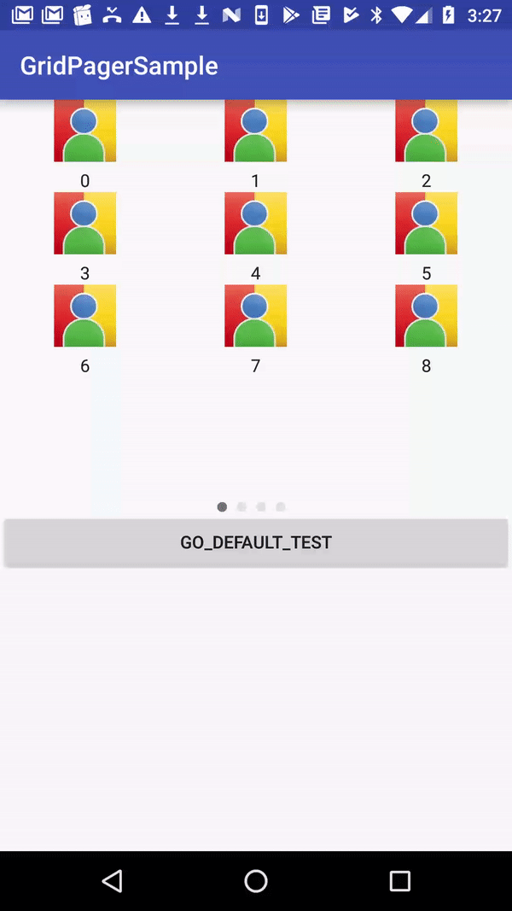

# GridPagerView
GridPager + indicator
=====

GridPagerView는 GridView와 Indicator를 손쉽게 제공합니다.


GridPagerView는 Glide를 포함하고 있습니다.

Download
--------

```gradle
allprojects {
  repositories {
  	..
   	maven { url 'https://jitpack.io' }
   	..
  }
}

dependencies {
  implementation 'com.github.csmugene:GridPagerView:0.2'
}
```


-------------------

샘플앱의 MainActivity.java와 DefaultViewActivity.java를 확인하세요.

아래 사용법은 기본 사용법으로 라이브러리 내부에 있는 셀을 이용하여 화면상에 보여주게 됩니다.

기본 사용법
--------

```java
// For a simple view:
    ArrayList<String> mImageArray = new ArrayList<>();
    ArrayList<String> mTitleArray = new ArrayList<>();
    private final static String TAG = "DefaultViewActivity";
    @Override
    protected void onCreate(Bundle savedInstanceState) {
        super.onCreate(savedInstanceState);
        setContentView(R.layout.activity_main);
        

        for(int i = 1; i < 100; i++){
            mImageArray.add("image path");
            mTitleArray.add(String.format("%d", i));
        }

        //top, left, right, bottom
        int[] margin = {0, 0, 20, 0};

        //ImageUrl Array, Title Array, Span, Line
        GridConfig gridConfig = new GridConfig(mImageArray, mTitleArray , 3, 3);
        IndicatorView indicatorView = (IndicatorView)findViewById(R.id.indicatorView);
        GridViewPager gridViewPager = (GridViewPager)findViewById(R.id.gridViewPager);
        gridViewPager.setFragmentManager(getSupportFragmentManager());
        gridViewPager.setGridConfig(gridConfig);
        gridViewPager.setOnItemClickListener(new OnItemClickListener() {
            @Override
            public void onItemClick(View view, int position) {
                Log.e(TAG, String.format("position : %d", position));
            }
        });
        GridPagerViewFactory gridPagerViewFactory = new GridPagerViewFactory(this);
        gridPagerViewFactory.init(gridViewPager);
        FragmentStatePagerAdapter adapter = gridPagerViewFactory.getFragmentAdapter(getSupportFragmentManager());
        gridViewPager.setAdapter(adapter);
        gridPagerViewFactory.makeIndicator(indicatorView, margin, new OnIndicatorItemClickListener() {
            @Override
            public void onItemClick(int position) {

            }
        });
    }
```

이 외에도 그리드뷰에 들어가는 셀을 커스텀하여 사용가능합니다.

커스텀 사용법
--------

```java
    ArrayList<String> mImageArray = new ArrayList<>();
    ArrayList<String> mTitleArray = new ArrayList<>();
    private final static String TAG = "MAINACTIVITY";
    @Override
    protected void onCreate(Bundle savedInstanceState) {
        super.onCreate(savedInstanceState);
        setContentView(R.layout.activity_main);
        

        for(int i = 0; i < 100; i++){
            mImageArray.add("image path");
            mTitleArray.add(String.format("%d", i));
        }

        //top, left, right, bottom
        int[] margin = {0, 0, 20, 0};

		//ImageUrl Array, Title Array, Span, Line
        GridConfig gridConfig = new GridConfig(mImageArray, mTitleArray , 3, 3);
        IndicatorView indicatorView = (IndicatorView)findViewById(R.id.indicatorView);
        GridViewPager gridViewPager = (GridViewPager)findViewById(R.id.gridViewPager);
        gridViewPager.setFragmentManager(getSupportFragmentManager());
        gridViewPager.setGridConfig(gridConfig);
        gridViewPager.setOnItemClickListener(new OnItemClickListener() {
            @Override
            public void onItemClick(View view, int position) {
                Log.e(TAG, String.format("position : %d", position));
            }
        });
        GridPagerViewFactory gridPagerViewFactory = new GridPagerViewFactory(this);
        gridPagerViewFactory.init(gridViewPager);
        gridPagerViewFactory.setOnBinderViewHolderListener(new OnBinderViewHolderListener() {

            @Override
            public void onBindViewHolder(AdapterViewHolder holder, int position, List<String> iconUrlArrayList, List<String> titleArrayList) {
            	//onBindViewHolder callback
                String imageUrl = iconUrlArrayList.get(position);
                String title = titleArrayList.get(position);
                ViewHolder viewHolder = (ViewHolder)holder;
                viewHolder.textView.setText(title);
                Glide.with(MainActivity.this)
                        .load(imageUrl)
                        .dontAnimate()
                        .diskCacheStrategy(DiskCacheStrategy.ALL)
                        .skipMemoryCache(true)
                        .into(viewHolder.imageView);
            }

            @Override
            public AdapterViewHolder onCreateViewHolder(ViewGroup parent, int viewType) {
            	//onCreateViewHolder callback
                View v = LayoutInflater.from(MainActivity.this).inflate(R.layout.grid_cell, parent, false);
                return new ViewHolder(v);
            }
        });
        FragmentStatePagerAdapter adapter = gridPagerViewFactory.getFragmentAdapter(getSupportFragmentManager());
        gridViewPager.setAdapter(adapter);
        gridPagerViewFactory.makeIndicator(indicatorView, margin, new OnIndicatorItemClickListener() {
            @Override
            public void onItemClick(int position) {

            }
        });
    }

    @Override
    public void onResume(){
        super.onResume();

    }

    public class ViewHolder extends AdapterViewHolder{

        TextView textView;
        ImageView imageView;

        public ViewHolder(View itemView) {
            super(itemView);
            textView = (TextView)itemView.findViewById(R.id.title);
            imageView = (ImageView) itemView.findViewById(R.id.image);

        }
    }
```


Thanks
------
* **LEE MINSUB** and **HEO JAESEONG** and **KIM ANNA** and **PARK JINYONG** and **LEE JIHOON** and **SON JIHYE**
* **SWEETTRACKER**

Author
------
LEE CHUNGSUB of SWEETTRACKER

License
-------
BSD, part MIT and Apache 2.0.
